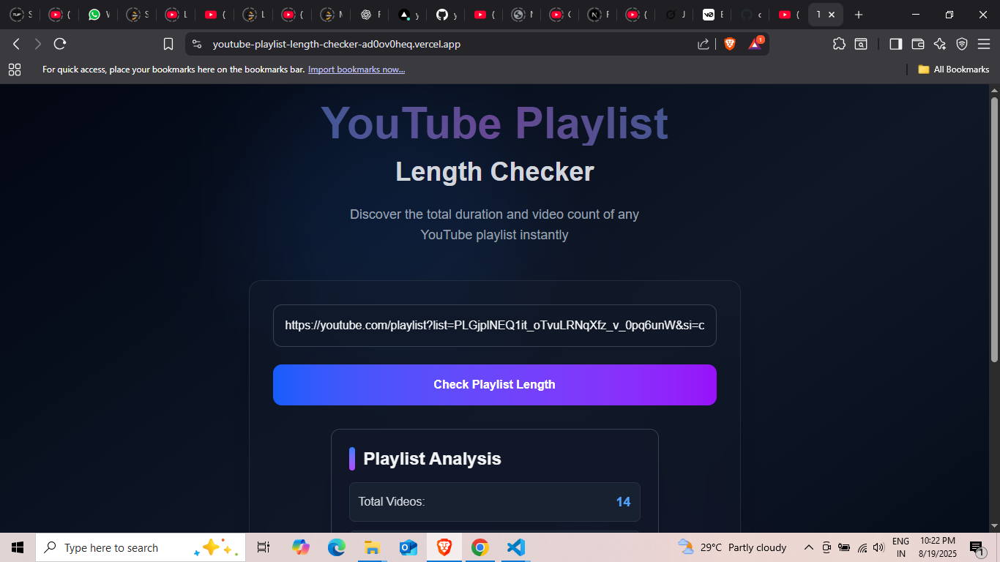

# 🎬 YouTube Playlist Length Checker

A **Next.js + Tailwind CSS** web app that calculates the **total duration** of any YouTube playlist.  
It also shows the **number of videos** and the **watch time at different speeds** (1.25x, 1.5x, 1.75x, 2x).

---

## 🚀 Features
- ✅ Enter a YouTube playlist link and get the total watch time  
- ✅ Displays playlist **title** and **number of videos**  
- ✅ Calculates **watch time at different speeds**  
- ✅ Modern UI built with **Tailwind CSS**  
- ✅ Fully responsive and fast (thanks to **Next.js 14 App Router**)  

---

## 📸 Screenshot




---

## 🛠️ Tech Stack
- [Next.js](https://nextjs.org/) (React Framework)
- [Tailwind CSS](https://tailwindcss.com/) (Styling)
- [YouTube Data API v3](https://developers.google.com/youtube/v3) (Data fetching)
- [Vercel](https://vercel.com/) (Deployment)

---

## ⚙️ Installation & Setup

Clone the repository:
```bash
git clone https://github.com/captainTushar/youtube-playlist-length-checker.git
cd youtube-playlist-length-checker
